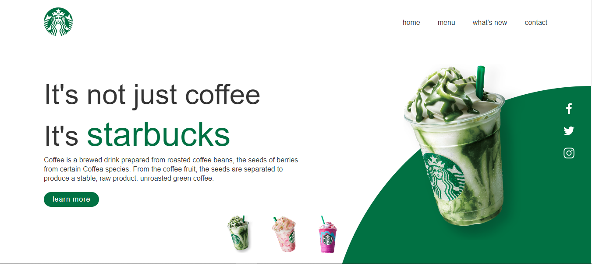

# Starbucks Landing Page



## Overview

This project is a landing page for Starbucks, created using HTML, CSS, and JavaScript. The landing page includes a visually appealing design, interactive elements, and responsive layout to provide a seamless user experience.

## Features

- **Responsive Design:** The page adjusts to different screen sizes, providing an optimal viewing experience on desktops, tablets, and mobile devices.
- **Interactive Elements:** Includes dynamic features such as sliders, modals, and animations to engage users.
- **Modern Aesthetic:** Clean and modern design to reflect the brand's identity.

## Technologies Used

- **HTML5:** For structuring the content.
- **CSS3:** For styling and layout.
  - Flexbox and Grid for layout.
  - Animations and transitions for interactive elements.
- **JavaScript:** For dynamic interactions and functionalities.
  - Event listeners and DOM manipulation.
  - Smooth scrolling and form validation.

## Installation

1. Clone the repository to your local machine:

    ```sh
    git clone https://github.com/MohidulCreative/starbucks-landing-page.git
    ```

2. Navigate to the project directory:

    ```sh
    cd starbucks-landing-page
    ```

3. Open the `index.html` file in your preferred web browser:

    ```sh
    open index.html
    ```

## Usage

- Open the `index.html` file in your browser to view the landing page.
- Explore the interactive elements such as the navigation menu, sliders, and buttons.
- Resize the browser window to see the responsive design in action.


